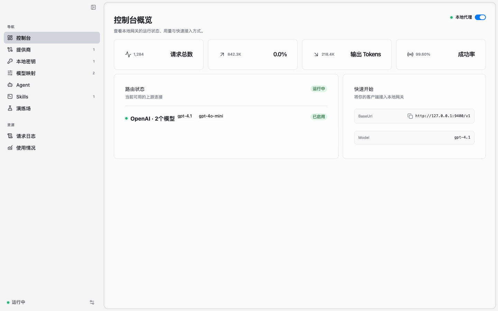
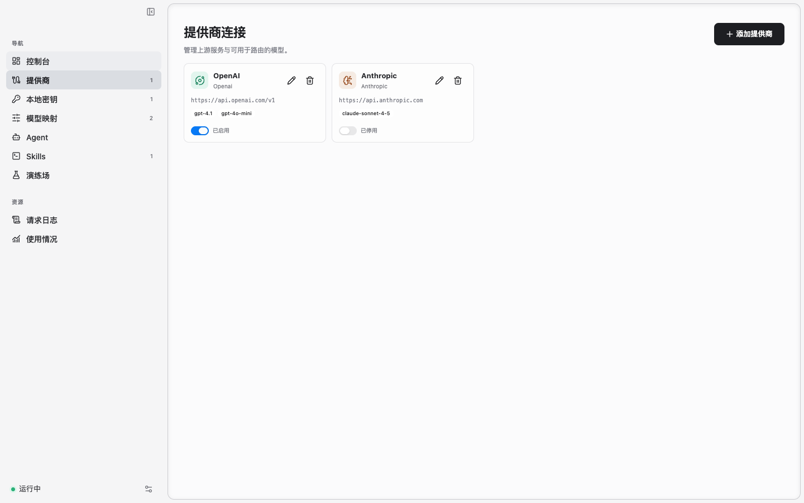
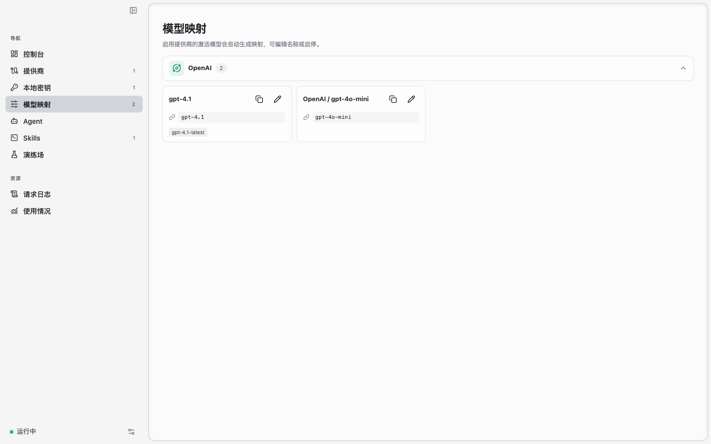
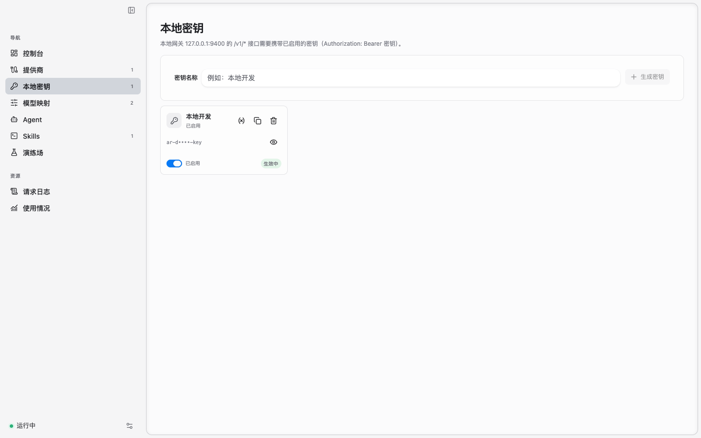
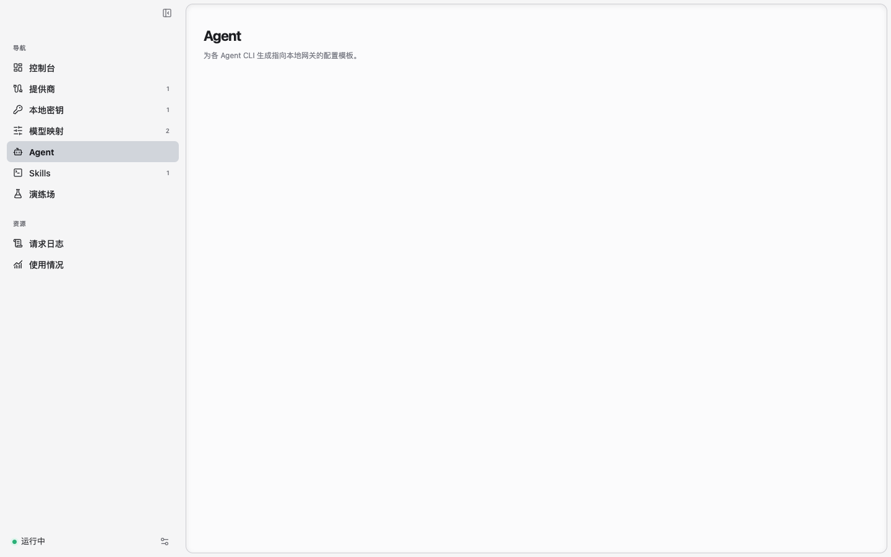

# Agent Router

Agent Router 是一个本地 LLM 路由网关和桌面配置台。它在 `127.0.0.1:9400`
提供本地 HTTP 服务，把 OpenAI、Anthropic、Gemini 和 OpenAI 兼容服务统一接入，
再由桌面界面管理模型映射、上游 API Key 池、请求日志和 CLI 配置。

## 主要能力

- 通过 OpenAI 兼容的 `/v1/chat/completions`、Anthropic 的 `/v1/messages` 和
  Codex CLI 使用的 `/v1/responses` 接入客户端。
- 一个客户端模型名可映射到多个提供商，默认按配置顺序 failover，也可切到
  `round_robin` 分摊流量。
- 每个提供商可配置多条上游 API Key，并选择会话粘性、轮询、用少优先或随机策略。
- 在「Agent」页为 opencode、KiloCode、MIMO Code、Oh My Pi、pi、Claude Code、
  Codex 生成或合并接入配置。
- 查看请求日志、Token 用量、提供商、模型和上游 Key 的统计。

## 界面预览

### 控制台概览



| 提供商连接 | 模型映射 |
| --- | --- |
|  |  |

| 本地密钥 | Agent 配置 |
| --- | --- |
|  |  |

截图使用前端演示数据，不包含真实 API Key、请求内容或用量记录。

## 快速开始

### 1. 准备运行环境

需要：

- Go 1.25+
- Node.js 和 npm
- Wails CLI v2，例如：

```bash
go install github.com/wailsapp/wails/v2/cmd/wails@v2.14.0
```

本项目使用纯 Go SQLite 驱动，不需要 cgo。

### 2. 启动应用

```bash
wails dev
```

也可以构建桌面应用：

```bash
wails build
```

窗口关闭后应用默认隐藏到托盘，本地网关继续运行；需要完全退出时使用托盘菜单或
`Cmd+Q`。

### 3. 配置上游提供商

1. 打开「提供商连接」，添加或编辑提供商，填写 Base URL 和 API Key。
2. 启用提供商，并勾选需要暴露给路由的模型。
3. 打开「模型映射」。启用提供商的模型会自动生成映射；也可以编辑客户端模型名、
   上游模型名、别名和启停状态。
4. 同一个客户端模型名可以保留多条映射，形成 failover 链。链首卡片可选择：
   - `failover`：默认，始终先请求链首，失败后再试下一家。
   - `round_robin`：每次请求从链上的下一家开始，起点之后的顺序仍在失败时生效。

别名可以命中同一条路由，但不会出现在 `/v1/models` 或生成的 CLI 配置中。

### 4. 创建本地密钥

打开「本地密钥」，创建并启用一个网关密钥。除 `/health` 外，所有 `/v1/*` 接口都
要求认证：

- OpenAI 兼容接口：`Authorization: Bearer <密钥>`
- Anthropic 接口：`x-api-key: <密钥>` 或 `Authorization: Bearer <密钥>`

「写入环境变量」会把密钥保存为 `AGENT_ROUTER_API_KEY`，供只支持环境变量认证的
CLI 使用。新终端才能读取到新值。

### 5. 接入客户端

OpenAI 兼容客户端填写：

```text
Base URL: http://127.0.0.1:9400/v1
API Key:  <本地网关密钥>
Model:    <「模型映射」中的客户端模型名>
```

Anthropic 客户端填写：

```text
Base URL: http://127.0.0.1:9400
API Key:  <本地网关密钥>
Model:    <映射到 Anthropic 提供商的客户端模型名>
```

「Agent」页可以自动生成各 CLI 的配置。写入时会合并现有配置；配置有变化并在覆盖前
生成 `<文件名>.<时间戳>` 备份，内容未变化时不写文件和备份。

| 工具 | 默认配置路径 |
| --- | --- |
| OpenCode | `~/.config/opencode/opencode.json` |
| KiloCode | `~/.config/kilo/kilo.jsonc` |
| MIMO Code | `~/.config/mimocode/mimocode.jsonc` |
| Oh My Pi | `~/.omp/agent/models.yml` |
| pi | `~/.pi/agent/models.json` |
| Claude Code | `~/.claude/settings.json` |
| Codex | `~/.codex/config.toml` |

Codex 会把选中的模型写成同目录下的 `<消毒后的模型名>.config.toml` profile，
用 `codex --profile <名称>` 切换；点号、斜杠等 Codex 不接受的字符会折成 `-`。
profile 只新增不删除。

### 6. 验证网关

```bash
curl http://127.0.0.1:9400/health

curl http://127.0.0.1:9400/v1/models \
  -H "Authorization: Bearer $AGENT_ROUTER_API_KEY"

curl http://127.0.0.1:9400/v1/chat/completions \
  -H "Authorization: Bearer $AGENT_ROUTER_API_KEY" \
  -H "Content-Type: application/json" \
  -d '{
    "model": "gpt-4.1",
    "messages": [{"role": "user", "content": "你好"}],
    "stream": false
  }'
```

## HTTP 接口

| 方法 | 路径 | 说明 |
| --- | --- | --- |
| `GET` | `/health` | 健康检查，无需认证 |
| `GET` | `/v1/models` | 列出当前可路由的客户端模型 |
| `POST` | `/v1/chat/completions` | OpenAI Chat Completions |
| `POST` | `/v1/messages` | Anthropic Messages |
| `POST` | `/v1/responses` | OpenAI Responses，供 Codex CLI 使用 |

`/v1/responses` 是转换层：网关把 Responses 请求转成 Chat Completions 发往上游，
再把流式或非流式响应转回 Responses 形状。它只支持 OpenAI 兼容提供商；映射到
Anthropic 提供商时会返回 `501`。`previous_response_id` 等依赖服务端会话存储的
字段不受支持，Codex 当前调用路径不依赖它们。

## 使用规则

- 仅添加和使用你有权访问的上游账号与 API Key，并遵守对应提供商的服务条款、
  配额、计费、内容与数据处理政策。
- 本地网关密钥可以调用网关上已启用的全部路由。不要公开密钥，也不要把带密钥的
  配置、终端环境或数据库文件共享给不受信任的人。
- 同名模型链启用跨提供商 failover 后，网关会在限流、鉴权失败或上游错误时尝试
  链上的下一家。若上游已经受理请求但随后返回错误，重试仍可能产生重复请求或计费；
  对成本敏感的场景应核对上游账单。
- 请求日志会保存请求体、响应体、Token 用量和路由信息，可能包含提示词、代码、
  文件内容或其它敏感数据。请把应用数据库视为敏感文件。
- 默认监听 `127.0.0.1`。只有在明确理解访问控制与网络边界后，才应改为
  `0.0.0.0` 或其它可被外部访问的地址。

## 数据与安全

- 应用数据库：
  - macOS：`~/Library/Application Support/AgentRouter/agent-router.db`
  - Linux：`~/.config/AgentRouter/agent-router.db`
  - Windows：`%AppData%\AgentRouter\agent-router.db`
- macOS 上，上游 API Key 存在系统 Keychain，服务名为
  `com.agentrouter.credentials`；SQLite 只保存不透明引用和短掩码。
- 非 macOS 开发环境当前使用进程内存保存上游密钥，应用重启后需要重新填写。
- 本地网关密钥需要让本地代理直接校验，因此保存在 SQLite 中。不要共享数据库文件。
- 监听地址默认为 `127.0.0.1`，只允许本机访问。切换到 `0.0.0.0` 后局域网可直接
  访问网关，请确保网关密钥和设备网络安全。

## 责任声明与许可状态

Agent Router 只是本地路由与配置工具，不提供模型，也不会绕过上游认证、配额、
计费或访问控制。模型输出、可用性、价格和数据处理方式由对应上游提供商决定；
使用者需要自行判断输出是否适用于自己的场景，并承担 API 费用、内容合规和账号
使用责任。请勿将本软件用于违反适用法律、侵害他人权益或规避服务限制的用途。

仓库当前未附带开源许可证。如需复制、修改、分发或用于商业项目，请先确认授权范围
并补充合适的许可证。

## 开发

```bash
go test ./...
cd frontend && npm run build
cd frontend && npm run formatter
```

后端构建需要先存在 `frontend/dist`；`wails build` 会先执行前端类型检查和 Vite
构建。更完整的架构、目录和约定见 [AGENTS.md](AGENTS.md)。

常见问题：

- 返回 `401`：确认客户端携带的是已启用的本地密钥。
- 返回 `404 model_not_found`：确认提供商和对应模型映射已启用。
- `/v1/responses` 返回 `501`：该模型当前只映射到 Anthropic 提供商，请同时配置
  OpenAI 兼容路由。
